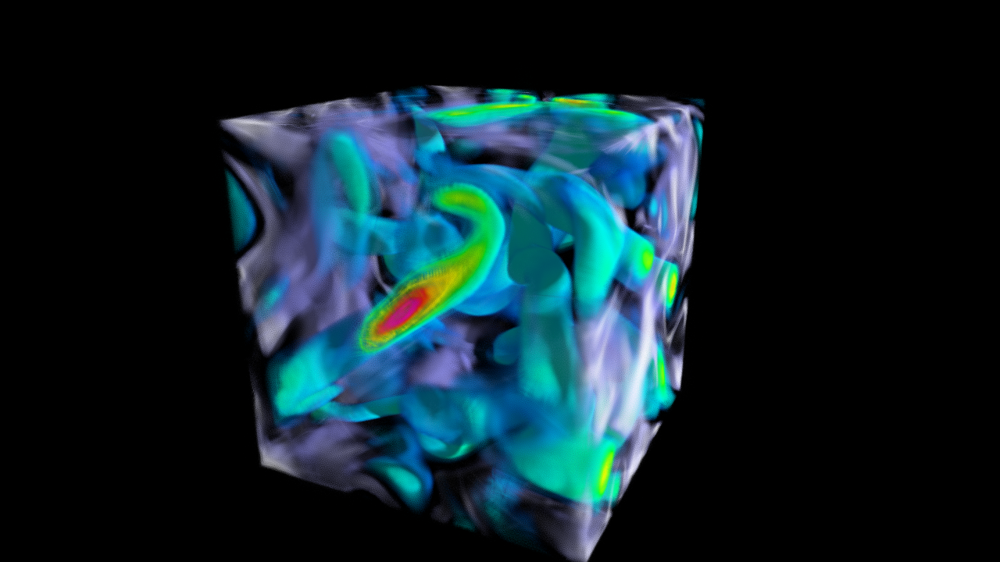
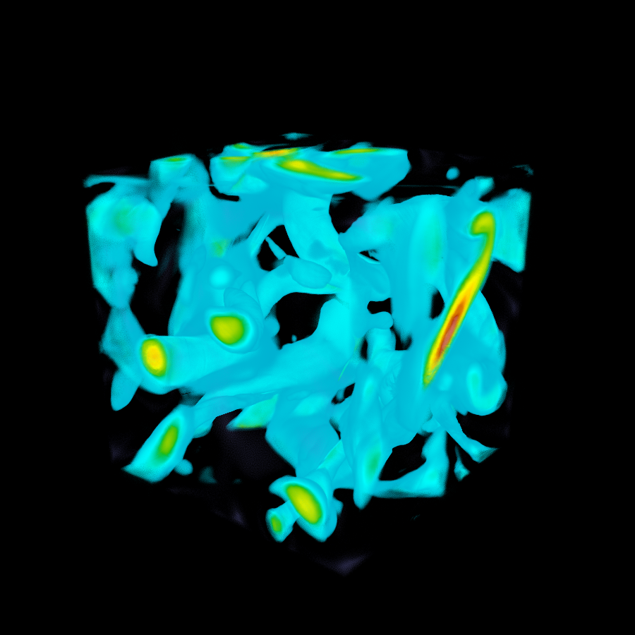
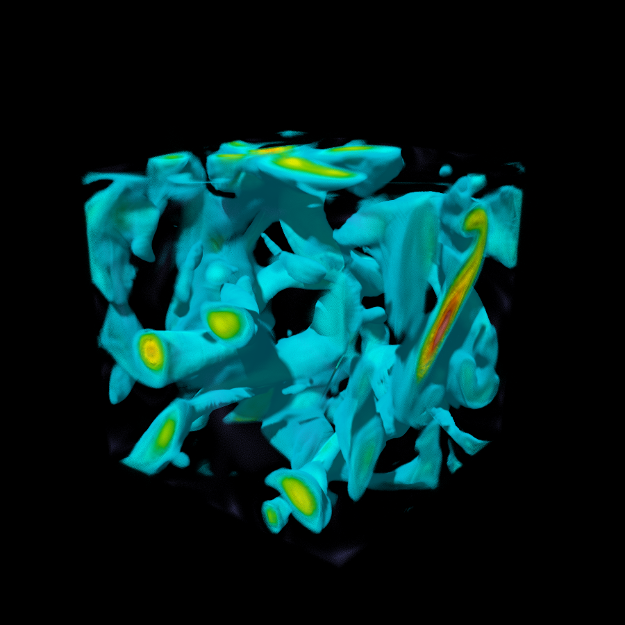
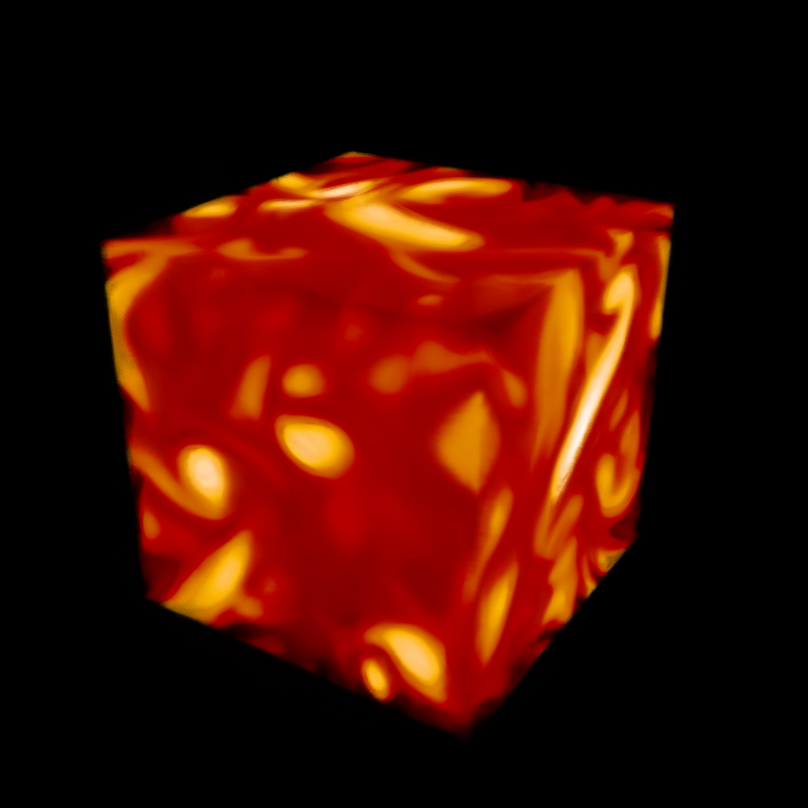
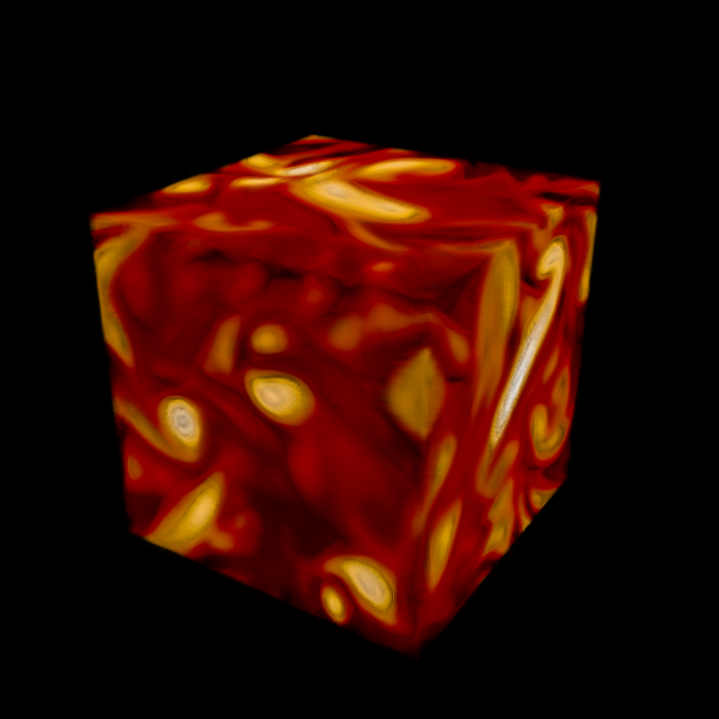
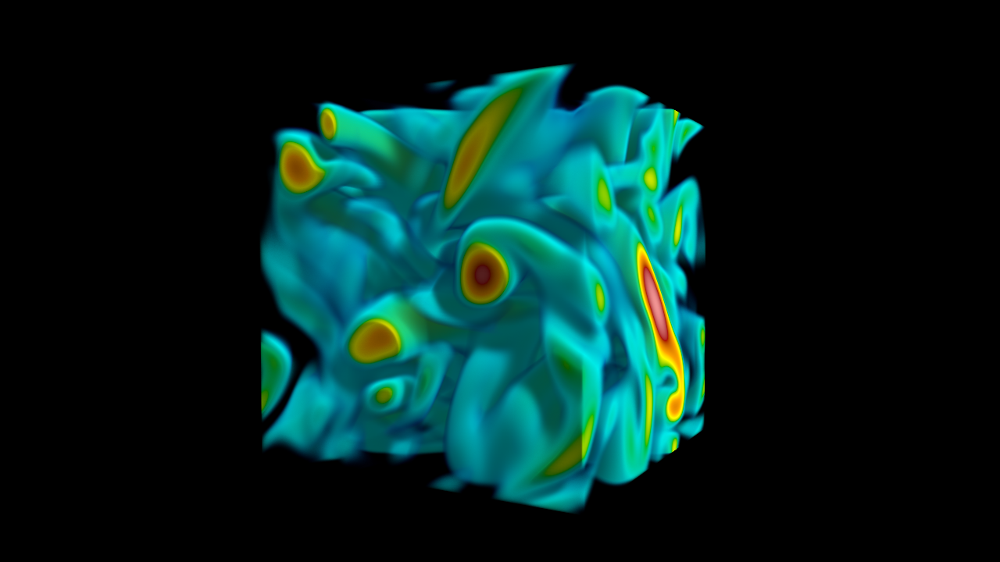

# gaussmarch
An OptiX 8 volume renderer for **[Volume Encoding Gaussians (VEG)](https://github.com/ldyken53/VEG)** -- scalar-field Gaussians with delta tracking ray marching and volumetric shadows.



Each Gaussian carries one scalar value per particle. Color and opacity are not baked into the scene -- they are computed live every frame from a **fully interactive transfer function**, letting you explore the full scalar range of a volume dataset without retraining.

---

## Acknowledgements

This project is inspired by and builds on ideas from:

> Nate Morrical, Stefan Zellmann, Alper Sahistan, Patrick Shriwise, Valerio Pascucci.
> **"Attribute-Aware RBFs: Interactive Visualization of Time Series Particle Volumes Using RT Core Range Queries."**
> *IEEE Transactions on Visualization and Computer Graphics*, Vol. 30, No. 1, January 2024.
> [https://par.nsf.gov/servlets/purl/10548263](https://par.nsf.gov/servlets/purl/10548263)

---

## Dependencies
- CUDA Toolkit 12.0+ (tested on 12.8, 13.0)
- NVIDIA OptiX SDK 8.1
- OpenGL 3.3+ (provided by your GPU driver)
- GLAD, stb_image, cxxopts, tinyfiledialogs (included in `third_party/`)
- GLFW3, GLM, Dear ImGui, ImPlot (included as submodules in `third_party/`)
- tfn (transfer function widget, included in `third_party/tfn/`)

## Build

```sh
git clone --recurse-submodules https://github.com/SP5555/gaussmarch.git
cd gaussmarch
```

Or if already cloned without submodules:
```sh
git submodule update --init
```

### Linux

```sh
export OPTIX_INSTALL_DIR=/path/to/OptiX
./build.sh
```

Or manually:
```sh
mkdir build && cd build
cmake .. -DCMAKE_BUILD_TYPE=Release -DOptiX_INSTALL_DIR=/path/to/OptiX [-DCMAKE_CUDA_ARCHITECTURES=89]
cmake --build . --parallel $(nproc)
```

Or set the environment variable instead of passing the flag every time:
```sh
export OPTIX_INSTALL_DIR=/path/to/OptiX
```

### Windows

**PowerShell** (use `$env:` -- not `set`, which creates a PowerShell variable that batch scripts can't see):
```powershell
$env:OPTIX_INSTALL_DIR = "C:\path\to\OptiX"
.\build.bat
```

**Command Prompt:**
```bat
set OPTIX_INSTALL_DIR=C:\path\to\OptiX
.\build.bat
```

Or manually:
```bat
mkdir build && cd build
cmake .. -G "Visual Studio 17 2022" -A x64 -DOptiX_INSTALL_DIR="C:\path\to\OptiX" [-DCMAKE_CUDA_ARCHITECTURES=89]
cmake --build . --config Release --parallel
```

> Common architecture values: 75 = Turing (RTX 20xx), 86 = Ampere (RTX 30xx), 89 = Ada (RTX 40xx), 90 = Hopper, 120 = Blackwell (RTX 50xx)
> Not sure which one? Run `nvidia-smi` to get your GPU model and look it up: https://developer.nvidia.com/cuda/gpus

---

## gaussmarch (Gaussian Volume Renderer)

Real-time volume renderer for scenes trained with [VEG](https://github.com/ldyken53/VEG) -- a 3DGS variant where each Gaussian encodes a scalar value instead of spherical harmonics. Color and opacity are not baked into the scene; they are computed live at every frame from a **fully interactive transfer function**, letting you explore the entire scalar range of a volume dataset without ever retraining.

Paint your own color map, sculpt the opacity curve, and watch the scene transform **instantly** -- zero reloading, zero retraining, zero lag.

- **Live transfer function** -- recolor and reshape opacity in real time, no retraining.
- **Stochastic scatter** -- fixed-step ray march with a delta tracking criterion: accumulate density until a sampled threshold is exceeded, then fire a scatter event.
- **Volumetric shadows** -- deterministic Beer-Lambert transmittance march from each scatter point toward the light reveals depth and internal structure.
- **Temporal accumulation** -- averages across frames for a noise-free converged image.

Volumetric shadows are what set gaussmarch apart -- a secondary transmittance ray from each scatter point toward the light reveals internal structure that flat ambient rendering completely hides.

<p align="center">
  <table width="100%">
    <tr>
      <th width="50%">Ambient 1.0 (no shadows)</th>
      <th width="50%">Ambient 0.0 (full shadows)</th>
    </tr>
    <tr>
      <td></td>
      <td></td>
    </tr>
    <tr>
      <td></td>
      <td></td>
    </tr>
  </table>
</p>

> **Note:** gaussmarch only loads PLY files produced by the [VEG](https://github.com/ldyken53/VEG) training pipeline. Standard 3DGS PLY files are not supported.

| Flag | Default | Description |
|------|---------|-------------|
| `--scene` / `-s` | _(none)_ | Path to VEG `.ply` file -- if omitted, use the **Open PLY...** button in the UI |
| `--scale` | `1.0` | Scene scale applied after normalization (e.g. `2.0` doubles the scene size) |
| `--camera` | `arcball` | Camera mode: `fly` or `arcball` |

```sh
# Linux
./build/gaussmarch [--scene data/veg/vorts.ply] [--camera fly|arcball]

# Windows
.\build\Release\gaussmarch.exe [--scene data\veg\vorts.ply] [--camera fly|arcball]
```

A sample scene (`vorts` -- a simulated tornado vorticity field) is included in `data/veg/vorts.ply`.

### Render settings

| Parameter | Description |
|-----------|-------------|
| Step size | Ray march step distance (world units, scene normalized to [-1, 1]) |
| Max depth | Maximum march steps per ray |
| Accumulation | Temporal accumulation -- disable to see raw per-frame noise |
| Blue noise | Use STBN blue noise for sampling instead of PCG random |

### Lighting

Lower the ambient slider for stronger volumetric shadows; raise it to wash the scene with flat light.

| Parameter | Description |
|-----------|-------------|
| Shadows | Toggle volumetric shadow rays on/off |
| Azimuth | Light direction horizontal angle (0-360 deg) |
| Elevation | Light direction vertical angle (-90 = below horizon, 0 = horizon, 90 = above) |
| Shadow step | Step size for shadow rays -- larger = faster but softer shadows |
| Ambient | Ambient light factor -- 1.0 = no shadows, 0.0 = full shadows |

---

## volmarch (Raw Volume Renderer)

A true volume renderer for raw scalar field data (`.raw` / `.data` binary float32 files). Uses the exact same delta tracking and Beer-Lambert shadow pipeline as gaussmarch, but replaces Gaussian BVH point queries with direct trilinear interpolation into a 3D CUDA texture.

Built primarily as a reference renderer for qualitative comparison against the Gaussian representation, and as a foundation for future work (if I'm feeling powerful!) on end-to-end training pipelines where the ground truth renderer and the inference renderer share the same rendering formulation.



| Flag | Default | Description |
|------|---------|-------------|
| `--scene` / `-s` | _(none)_ | Path to raw volume file -- if omitted, use the **Open .raw...** button in the UI |
| `--camera` | `arcball` | Camera mode: `fly` or `arcball` |

Filename must follow the convention `name_DxDxD_float32.raw` so dimensions are parsed automatically. A sample volume (`vorts` -- 128×128×128 float32) is included in `data/raw/vorts1_128x128x128_float32.raw`.

```sh
# Linux
./build/volmarch [--scene data/raw/vorts1_128x128x128_float32.raw] [--camera fly|arcball]

# Windows
.\build\Release\volmarch.exe [--scene data\raw\vorts1_128x128x128_float32.raw] [--camera fly|arcball]
```

### Render settings

| Parameter | Description |
|-----------|-------------|
| Step size | Ray march step distance (world units, scene normalized to [-1, 1]) |
| Max depth | Maximum march steps per ray |
| Density scale | Multiplier on raw voxel values -- increase if the volume appears too transparent |
| Accumulation | Temporal accumulation -- disable to see raw per-frame noise |
| Blue noise | Use STBN blue noise for sampling instead of PCG random |

### Lighting

Same controls as gaussmarch.

| Parameter | Description |
|-----------|-------------|
| Shadows | Toggle volumetric shadow rays on/off |
| Azimuth | Light direction horizontal angle (0-360 deg) |
| Elevation | Light direction vertical angle (-90 = below horizon, 0 = horizon, 90 = above) |
| Shadow step | Step size for shadow rays |
| Ambient | Ambient light factor -- 1.0 = no shadows, 0.0 = full shadows |
